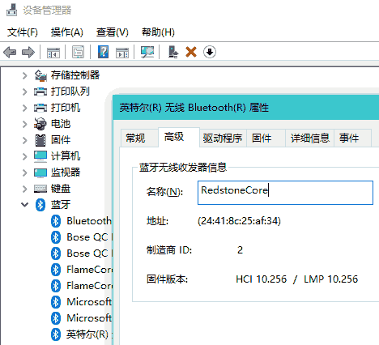
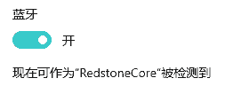
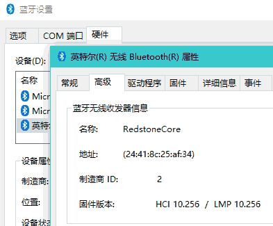

对, 非常脑瘫的设计, Win 10 默认情况下对外蓝牙识别名称是 **大写后的设备名称**, 且 **不允许修改**.

你问为什么要改这个设置?

因为我的蓝牙耳机连接到设备之后会提示 "Connected to xxx",
连手机没啥问题, 连 Windows 就会提示:
_Connected to R-E-D-S-T-O-N-E-C-O-R-E_ (一个字母一个字母蹦)
问题是电脑的名称是 _RedstoneCore_ 哦.

## 解决方案

* 打开 **设备管理器**
* 在 **蓝牙** 设备列表里找到电脑的蓝牙设备
* **双击打开属性**
* 打开 **高级** 选项卡
* 好了可以在这里改名称了

## 注意

不要从 _控制面板_ 或 _UWP 风格蓝牙设置页面_ 打开 _蓝牙设置_,
这个页面的显示名称是 **只读的**.

> [解决方案来源](https://superuser.com/questions/1183903/how-do-you-change-the-discoverable-bluetooth-name-of-a-windows-10-computer)
>
