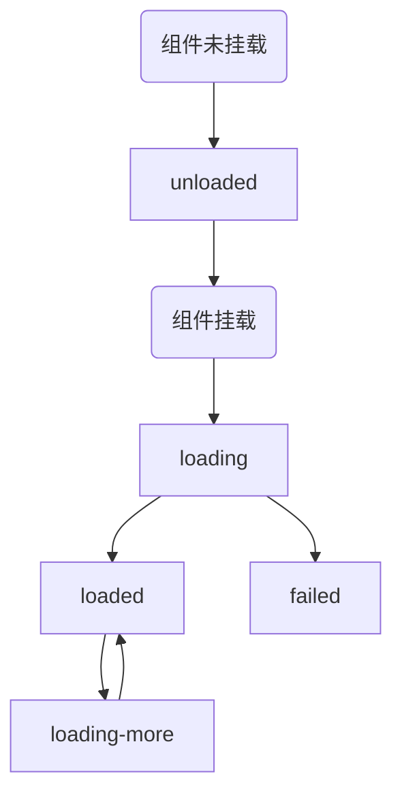

对于需要从后端加载数据并展示的组件, 个人习惯将内部的数据以如下结构储存:

```typescript
/**
 * 分页数据
 */
interface PageEntity<TypeData> {
  countPage: number;
  countRecord: number;
  pageIndex: number;
  pageSize: number;
  records: TypeData[];
  hasNextPage: boolean;
  hasPrevPage: boolean;
}
/**
 * 组件状态
 */
type ComponentStatus = 'unloaded' | 'loading' | 'loaded' | 'failed' | 'loading-more'
/**
 * 组件数据
 */
interface ComponentData<TypeData>
{
  data: PageEntity<TypeData>;
  status: ComponentStatus;
  error: any;
}
```

对于组件状态 `status` 的描述如下:

* `unloaded` 组件初始化并挂载到 DOM 树之前, 内部数据的初始状态. 理论上用户看不到这个状态的控件, 因为控件在控件被挂载的时候已经开始执行数据加载
* `loading` 组件处于初次加载数据的过程. 此时组件没有可供展示的数据, 页面一般只会显示一个 "数据加载中"
* `loaded` 组件完成数据加载. 组件开始正常对外展示分页数据
* `loading-more` 组件正在加载更多分页数据. 已有的数据正常展示, 但是在列表顶部或底部需要显示一个 "数据加载中"
* `failed` 组件在加载数据的过程中遇到错误



